Metadata schemas in the ManGO portal
================
Mariana Montes
3/27/23

- <a href="#sec-draft" id="toc-sec-draft">1 Schema design</a>
- <a href="#sec-lifecycle" id="toc-sec-lifecycle">2 Versioning and lifecycle</a>
- <a href="#sec-application" id="toc-sec-application">3 Apply metadata with a schema</a>

This article describes the ManGO portal functionalities related to
metadata schemas: how to design them and how to apply them. Users who
might want to design their own schemas independently and load them via
JSON, as well as developers interested in implemented this feature
outside the portal, are directed to [the technical
specifications](metadata-schemas-tech.qmd).

One crucial principle of the metadata schema functionality in the ManGO
portal is that schemas that can be used to apply metadata cannot be
modified. In other words, for a schema to be used in metadata annotation
it must be fixed and stable; a schema that is undergoing changes cannot
reliably be used for annotation. However, during the course of a
research project it might be necessary to update a schema, and it would
be impractical to create whole new schemas with different names for
every such change. In order to tackle this issue, the ManGO portal
implements a lifecycle via versioning and tags. In short, a schema can
evolve and its evolutions can be registered as new versions of the same
schema. Each version can have one of three statuses: (1) ‘draft’, while
it is being designed and edited; (2) ‘published’, when it is ready to be
implemented; and (3) ‘archived’, when it should not be used anymore,
maybe because a new version has been published.

In this context, the rest of this document will walk you through the
process of creating, managing and applying metadata schemas. First,
[Section 1](#sec-draft) will illustrate how to design a new schema from
scratch and save a draft. Then, [Section 2](#sec-lifecycle) will briefly
discuss the stages of a schema in more detail, including how they can be
managed in the Metadata Schema Manager (the “Metadata schemas” tab in
the ManGO portal). Finally, [Section 3](#sec-application) will show how
a published schema can be used to annotate metadata.

# Schema design

In order to design a new schema, we need to go to the “Metadata schemas”
section via the left sidebar menu. This will first show a selection of
projects (“realms”) to which your schemas may belong. After choosing
one, the schema manager per se is shown (see [Figure 1](#fig-start)): it
has a button to create a new schema, under which any existing schemas
are listed. Clicking on the button opens up a form on which the schema
can be designed. As shown in [Figure 1 (b)](#fig-schemaeditor), it
includes a field to provide a name, one for a user-facing title and a
button to add a field.

<table>
<colgroup>
<col style="width: 50%" />
<col style="width: 50%" />
</colgroup>
<tbody>
<tr class="odd">
<td style="text-align: center;">

<figure>
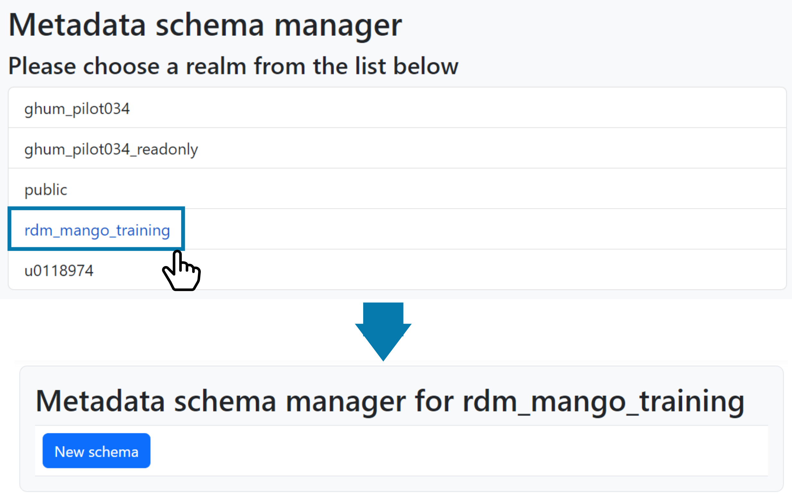
<figcaption aria-hidden="true">(a) Choose a realm.</figcaption>
</figure>

</td>
<td style="text-align: center;">

<figure>
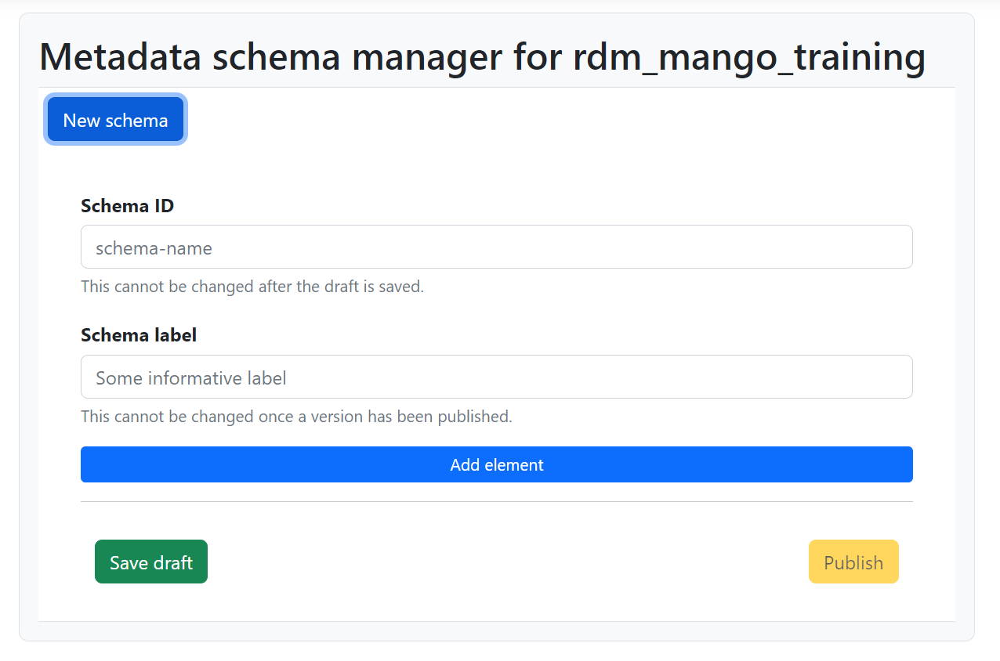
<figcaption aria-hidden="true">(b) An empty schema to start
with.</figcaption>
</figure>

</td>
</tr>
</tbody>
</table>

Figure 1: A new schema from scratch.

The “Schema ID” field is meant for the unique ID or name of a schema
and, like the “Schema label”, is shared by all the versions of the same
schema. Given an ID `book`, the attribute names of all the metadata
fields belonging to this schema will be prefixed with `mgs.book.`. This
is why some restrictions apply to the format of the ID: it can only
contain lowercase letters, numbers, hyphens and underscores. In
contrast, the label can be any type of name or title and will be used to
represent the schema in user-facing interactions, as will be shown
later. In this documentation, we will exemplify with a schema named
`book` with the label “Book schema as an example”.

The “Add element” button opens a modal that offers the different kinds
of fields that can be added to a schema with examples
([Figure 2](#fig-fields)):

- Simple fields result in input fields for texts, numbers, dates and
  similar formats or a single checkbox.

- Single-value multiple fields result in a dropdown or radio buttons and
  are used when the metadata value must be one of a selection of
  possible values.

- Multiple-value multiple fields result in a dropdown or checkboxes and
  are used when the metadata value may be many of a selection of
  possible values. As a result, the same attribute name is repeated with
  different attribute values.

- Composite fields are like nested schemas: groups of other kinds of
  fields that describe the same concept.

<figure>
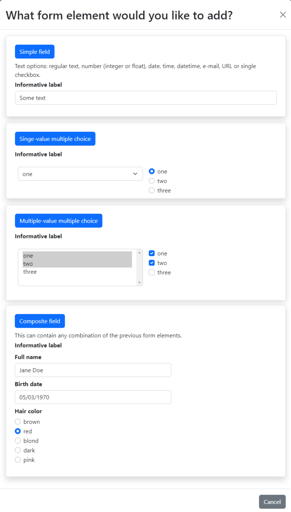
<figcaption aria-hidden="true">Figure 2: Options to select a type of
input field.</figcaption>
</figure>

The blue buttons with the names of the types of fields open new modals
with forms that can be used to design an instance of this field (see
[Figure 3](#fig-editors)). All these forms start with two text fields to
define an ID and a label for the field and end with a button to add the
new field to the schema. In between there are more specific input fields
used to refine the characteristics of the field you want to design as
well as up to two switch buttons to implement optional properties.

<table>
<colgroup>
<col style="width: 50%" />
<col style="width: 50%" />
</colgroup>
<tbody>
<tr class="odd">
<td style="text-align: center;">

<figure>
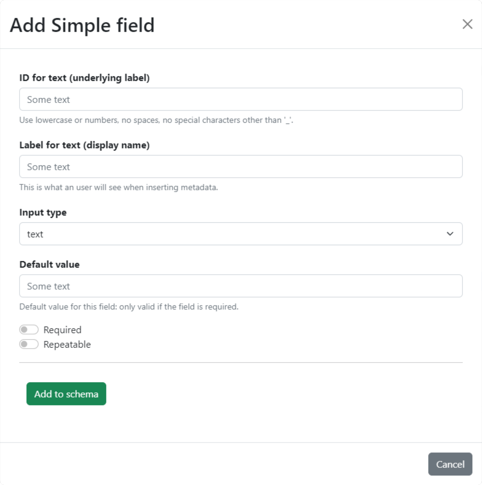
<figcaption aria-hidden="true">(a) Design a simple field.</figcaption>
</figure>

</td>
<td style="text-align: center;">

<figure>
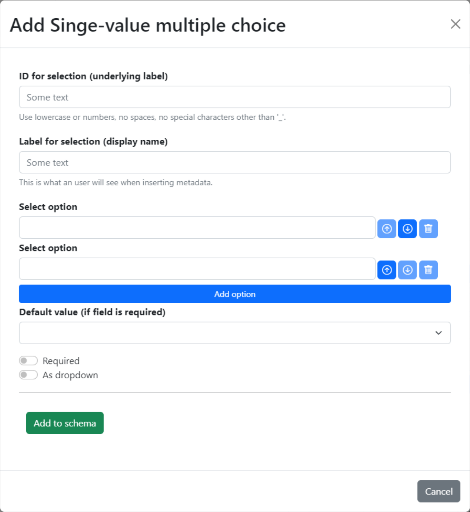
<figcaption aria-hidden="true">(b) Design a single-value multiple-choice
field.</figcaption>
</figure>

</td>
</tr>
</tbody>
</table>

<table>
<colgroup>
<col style="width: 50%" />
<col style="width: 50%" />
</colgroup>
<tbody>
<tr class="odd">
<td style="text-align: center;">

<figure>
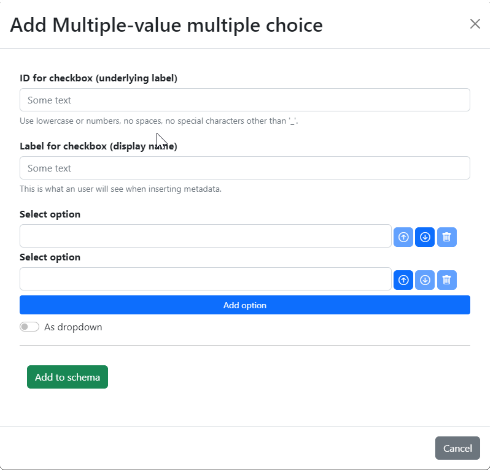
<figcaption aria-hidden="true">(c) Design a multiple-value
multiple-choice field.</figcaption>
</figure>

</td>
<td style="text-align: center;">

<figure>
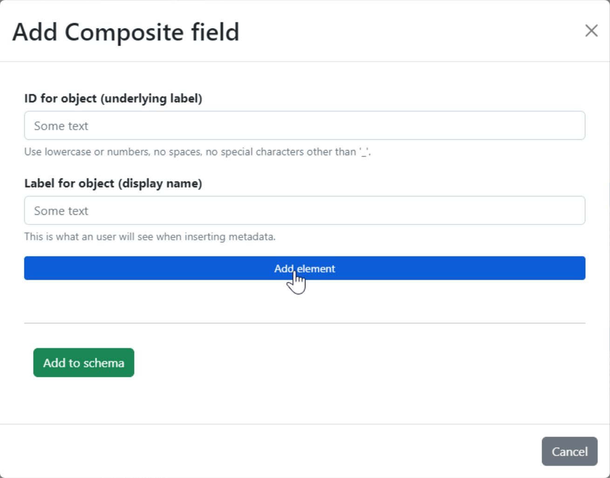
<figcaption aria-hidden="true">(d) Design a single-value multiple-choice
field.</figcaption>
</figure>

</td>
</tr>
</tbody>
</table>

Figure 3: Forms to design a new field.

For example, clicking on “Simple field” will open the form in [Figure 3
(a)](#fig-simple). After the common fields for ID and label, we see a
dropdown menu that offers different kinds of simple fields: text,
textbox, email, url, integer, float, date, time, datetime… If “integer”
or “float” are chosen, two new fields show up to provide minimum and
maximum thresholds for the value of the field. Via the switches at the
bottom the field can be made required (that is, when filling the
metadata, this field *has* to be provided) and/or repeatable (when
filling the metadata, we can create multiple copies with the same
attribute name and different values). If it is required, we can also
provide a default value.

[Figure 4 (a)](#fig-simplefull) shows the same form as in [Figure 3
(a)](#fig-simple) after filling in some choices. The ID is now `title`,
which means that when applying the schema this will create an attribute
name `mgs.book.title`. The label is “Book title”, so that the form to
apply the metadata schema and the table used to inspect the existing
metadata will show this label. The field is also required, but has no
default value, and of type “text”.

Once we add this new field to the schema, a box for it is added to the
schema editor, as shown in [Figure 4 (b)](#fig-simpleview). The title
–but not the ID– is shown, followed by an asterisk to indicate that the
field is required. Underneath we see the input field as it would look
like in the final form with a small clarification of the type of input
field it is. On the top right corner fo the box some options are
provided to further manipulate the field and its position in the form.
The arrows allow us to move the field up and down, but they are disabled
at the moment because there are no other fields. The third button
creates a quick copy of the field as an aid to create a similar one. The
pencil reopens the editing modal if you want to change anything in the
field, and the trash bin can be used to delete the field altogether.

<table>
<colgroup>
<col style="width: 50%" />
<col style="width: 50%" />
</colgroup>
<tbody>
<tr class="odd">
<td style="text-align: center;">

<figure>
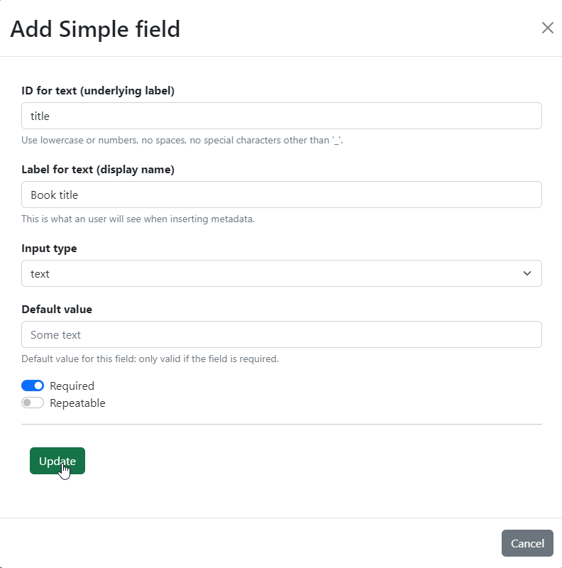
<figcaption aria-hidden="true">(a) A filled form for a simple
field.</figcaption>
</figure>

</td>
<td style="text-align: center;">

<figure>

<figcaption aria-hidden="true">(b) View of a designed simple
field.</figcaption>
</figure>

</td>
</tr>
</tbody>
</table>

Figure 4: Designing a simple field.

You can also see that in [Figure 4 (b)](#fig-simpleview) the box
representing the new field now has two “Add element” buttons: one to add
a field right before, and one to add a field right after. On clicking
one of these buttons we open again the modal shown in
[Figure 2](#fig-fields) and we can choose again the type of field we
want to add.

[Figure 5](#fig-new-radio) shows how we can edit a multiple-choice
field. As seen in [Figure 3](#fig-editors), the only differences between
the editors for single-value and multiple-value multiple-choice fields
are in the title of the modal and the possibility of defining a default
value for the former type[^1]. However, the results are also different.
If the “As dropdown” switch is activated (as shown in [Figure 5
(a)](#fig-radiofull)), the input field will look like a dropdown, but
the number of options that can be selected from it depend on whether
it’s a single-value or multiple-value field. If it is not activated,
single-value fields will be rendered as radio buttons, whereas
multiple-value ones will be rendered as checkboxes. In any case, the
middle part of the editors works in the same way in [Figure 3
(b)](#fig-radio) and [Figure 3 (c)](#fig-checkbox): we start we two
empty fields labeled “Select option” with three buttons to their right:
two arrows and a trash bin. The arrows allow us to reorder the options,
whereas the trash bin lets us remove one of the fields (but there cannot
be fewer than two). The big “Add option” button creates a new input
field for a new option, which must be either filled or deleted.

[Figure 5 (b)](#fig-radioview) shows how the dropdown created in
[Figure 5 (a)](#fig-radiofull) is rendered along the other field in the
schema editor. Again, it is labeled as “Publishing house”, although
metadata assigned via this field will have the name
`mgs.book.publisher`.

<table>
<colgroup>
<col style="width: 50%" />
<col style="width: 50%" />
</colgroup>
<tbody>
<tr class="odd">
<td style="text-align: center;">

<figure>
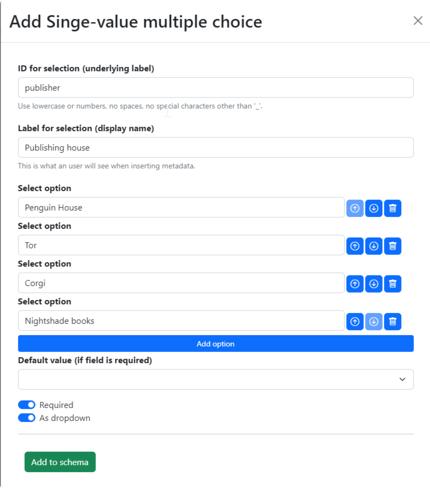
<figcaption aria-hidden="true">(a) A filled form for a single-value
multiple-choice field.</figcaption>
</figure>

</td>
<td style="text-align: center;">

<figure>
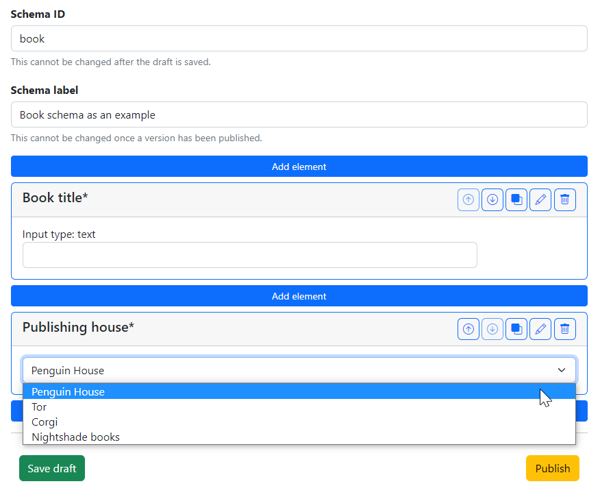
<figcaption aria-hidden="true">(b) View of a designed single-value
multiple-choice field.</figcaption>
</figure>

</td>
</tr>
</tbody>
</table>

Figure 5: Designing a single-value multiple-choice field.

[Figure 4 (b)](#fig-simpleview) and [Figure 5 (b)](#fig-radioview) also
show, at the bottom, two buttons: a green one labeled “Save draft” and a
yellow one that reads “Publish”. These buttons are also present in
[Figure 1](#fig-start), although in this case the “Publish” button is
disabled. This is because it is possible to create a draft that has no
fields yet, but not to publish it. Once we save a draft, a new accordion
item is created for the new schema in the page, with a tab for the draft
version. [Figure 6](#fig-saved) shows this tab after also adding a
non-required checkbox field between “Book title” and “Publishing house”
and saving the draft. The tab itself shows the version number and status
of this version and contains three buttons: one to view the form as it
will be shown when applying metadata, one to edit it, which opens a tab
that looks just like the editor we were working on, and one to discard
the draft. By clicking on “Discard” a modal pops up to ask for
confirmation: if we accept, all traces of this schema will be removed,
because the draft is its only existing version.

<figure>
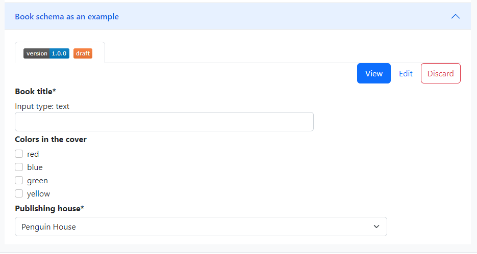
<figcaption aria-hidden="true">Figure 6: New draft.</figcaption>
</figure>

While the draft has not been published, we can still edit it: add new
fields, change them, reorder them, remove them… It is also possible to
change the title or label of the schema itself, but not to change the
ID. If we want to add a composite field, [Figure 3 (d)](#fig-composite)
shows that the editor starts like the editors of other fields, but then
just has an “Add element” button, which behaves exactly like the “Add
element” button of a schema: it oppens the modal in
[Figure 2](#fig-fields), which in turn opens the modal of the chosen
field type. [Figure 7 (a)](#fig-compositefull) shows an editor for a
composite field to which we have added three simple fields: a required
“Name and surname” of type text, an “Age” of type integer with a minimum
value of 12 and a maximum value of 99, and a required, repeatable “Email
address” of type email. Once we add the composite field to the schema,
its editing box ([Figure 7 (b)](#fig-compositeview)) shows its
components as they will appear in the final form; in order to edit them,
we first need to edit the composite field itself.

<table>
<colgroup>
<col style="width: 50%" />
<col style="width: 50%" />
</colgroup>
<tbody>
<tr class="odd">
<td style="text-align: center;">

<figure>
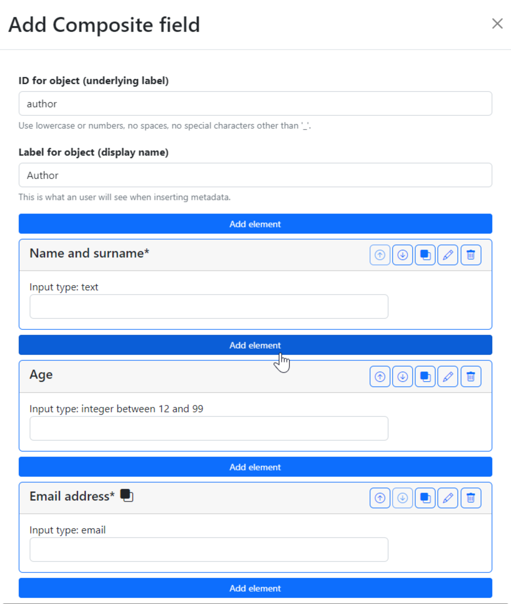
<figcaption aria-hidden="true">(a) A filled form for a composite
field.</figcaption>
</figure>

</td>
<td style="text-align: center;">

<figure>
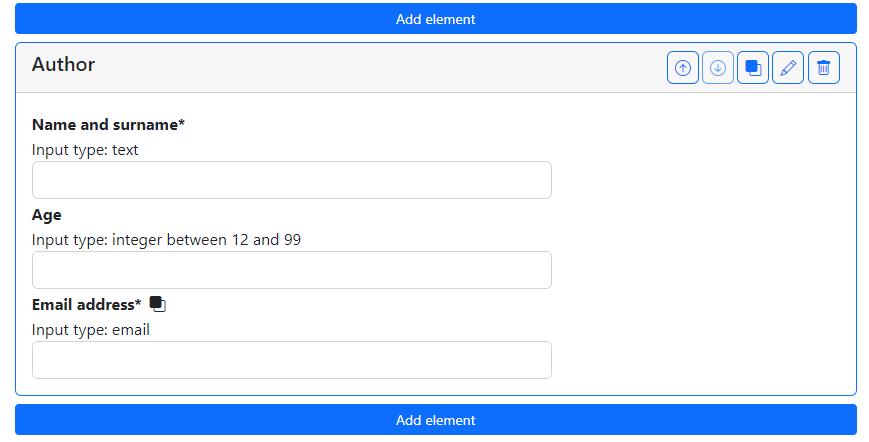
<figcaption aria-hidden="true">(b) View of a designed composite
field.</figcaption>
</figure>

</td>
</tr>
</tbody>
</table>

Figure 7: Designing a composite field.

# Versioning and lifecycle

Once you are satisfied with your draft is ready to be applied, you can
publish it. This will update the tab so that the orange badge “draft” is
replaced with a green one labeled “published”, and change the options
provided in the top right buttons ([Figure 8](#fig-published)). The
“View” tab, which shows the form as it will appear when applying the
metadata schema, is the same as for a draft version, but the rest of the
buttons have changed.

<figure>
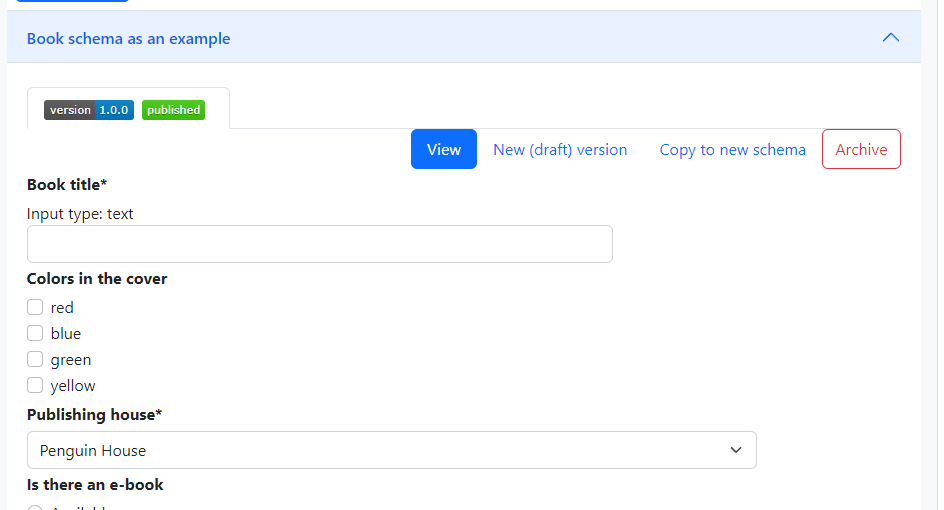
<figcaption aria-hidden="true">Figure 8: A published version of a
schema.</figcaption>
</figure>

“New (draft) version” and “Copy to new schema” open editors like “Edit”
did for the draft schemas. The difference between these two editors is
that the former creates a new draft for the same schema and the latter
starts a whole other schema with the same contents. Saving a new draft
will create a new version (in this case 2.0.0) and show it in a second
tab next to the published version, as shown in [Figure 9
(a)](#fig-published2). While a draft version exists, the “New (draft)
version” button is absent. When creating this draft, the Schema ID and
and label are fixed and cannot be edited. In contrast, in the editor in
“Copy to new schema” (shown in [Figure 9 (b)](#fig-clone)) these fields
are empty and, in fact, it is not possible to reuse the same Schema ID
we had before. Use cases for this feature are derived schemas,
i.e. schemas that share many fields with another schema but represent a
different thing. The name and version of the published schema it
originated from is recorded, but nothing is done with this information
yet.

<table>
<colgroup>
<col style="width: 50%" />
<col style="width: 50%" />
</colgroup>
<tbody>
<tr class="odd">
<td style="text-align: center;">

<figure>
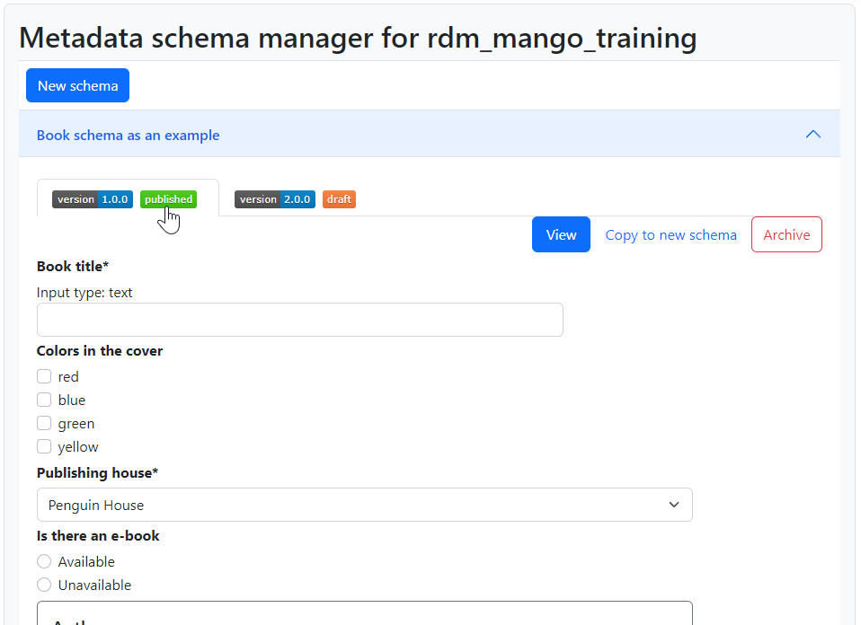
<figcaption aria-hidden="true">(a) A published version of a schema when
a draft exists.</figcaption>
</figure>

</td>
<td style="text-align: center;">

<figure>

<figcaption aria-hidden="true">(b) Draft a new schema from a published
version of a schema.</figcaption>
</figure>

</td>
</tr>
</tbody>
</table>

Figure 9: Create new drafts from a published version.

When this copy is saved, a new schema is created, like when we edit one
from scratch in “New schema”. This generates a new accordion item with
its own “draft” tab containing the version that was just created. Note
that it is also possible to publish a version of a schema, even a copy
from a published schema, without saving it as a draft first. In
[Figure 10](#fig-clone2) we could decide to view and edit this new
schema or the previous one by clicking on their name, which expands the
appropriate tabs. If we click on “Book schema as an example”, we’ll see
that the “Copy to new schema” section has been reset to the original
contents of the published version of this schema.

<figure>

<figcaption aria-hidden="true">Figure 10: Saved draft of copied
schema.</figcaption>
</figure>

Archiving a published version of a schema will prevent it from being
implemented, but won’t delete it. In the current version of the Metadata
Schema Manager, archived versions are not visible either. However, they
still exist, and it is not possible to create a new schema with the same
ID.

# Apply metadata with a schema

In order to apply a metadata schema, we first have to move to the
“Collections” tab of the ManGO portal and select the collection or data
object to which we want to add metadata. In the “Metadata” tab, a
dropdown will appear with the selection of published schemas, as shown
in [Figure 11 (a)](#fig-selectschema). Clicking on “Edit” will open a
page with the form shown in [Figure 11 (b)](#fig-apply), which is very
similar to what we could see in the “View” tab of the published schema
([Figure 8](#fig-published)). Required fields have an asterisk next to
their name, simple fields have a short description under their input
fields and repeatable fields have a button that can be used to duplicate
them.

<table>
<colgroup>
<col style="width: 50%" />
<col style="width: 50%" />
</colgroup>
<tbody>
<tr class="odd">
<td style="text-align: center;">

<figure>
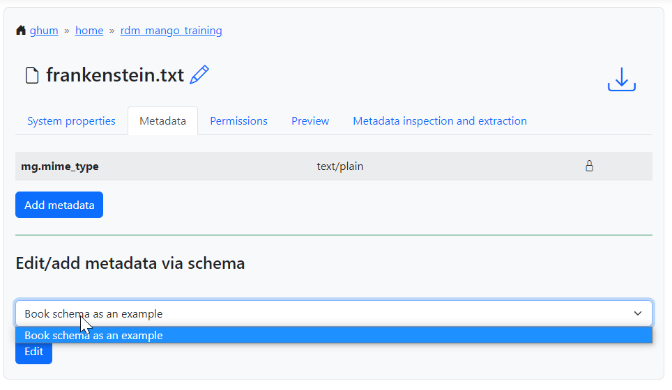
<figcaption aria-hidden="true">(a) Select a published metadata
schema.</figcaption>
</figure>

</td>
<td style="text-align: center;">

<figure>
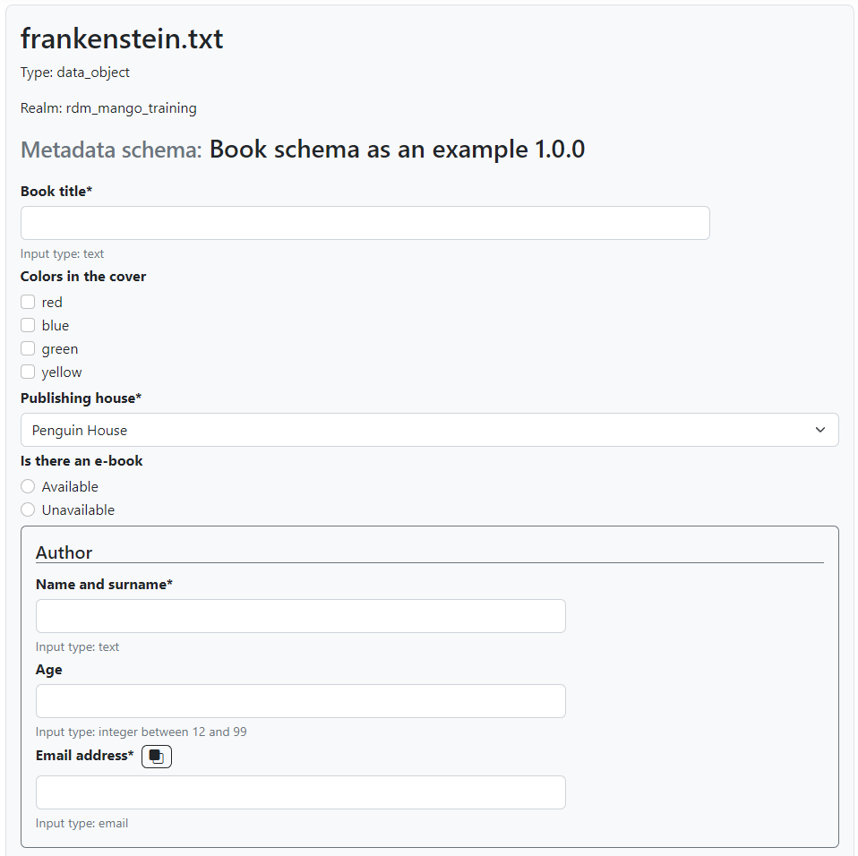
<figcaption aria-hidden="true">(b) Empty form to apply a metadata
schema</figcaption>
</figure>

</td>
</tr>
</tbody>
</table>

Figure 11: Apply a metadata schema.

If a required field is not filled, it won’t be possible to save the
metadata. Once we do save it, we can see the results in a tab inside the
“Metadata” tab of the object. [Figure 12](#fig-viewann) shows that the
user-facing label of the schema, not its name, is used to name the tab,
and that the labels of the different fields are used in the table that
shows the current annotation. Hovering over the labels will show a small
popover with the name that the AVU takes in ManGO, e.g. `mgs.book.title`
for the book title, `mgs.book.author.email` for the email address inside
the Author composite field, etc. Moreover, fields for which no values
have been provided can still be seen as empty, to indicate that the
schema has not been completely implemented.

<figure>
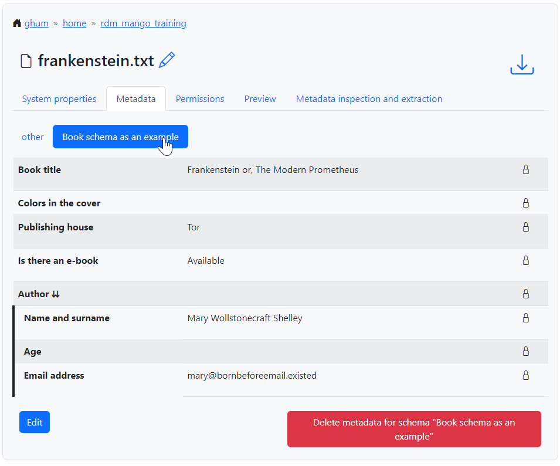
<figcaption aria-hidden="true">Figure 12: All metadata fields are shown,
with or without values.</figcaption>
</figure>

[^1]: Note that this default value can only be defined during editing,
    as it does not respond to recent changes in the list of options
